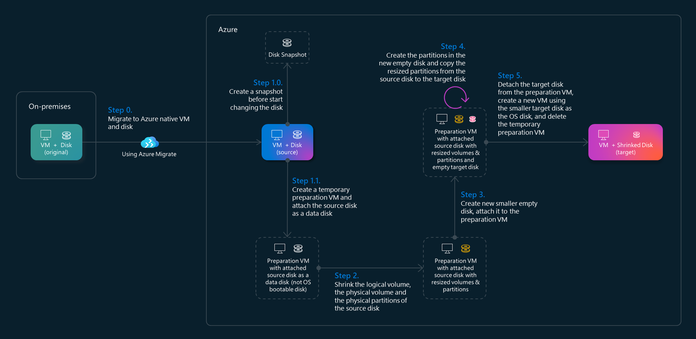
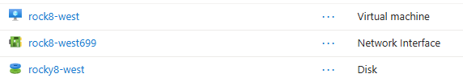
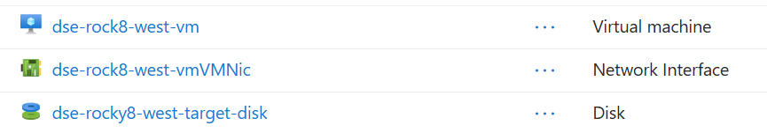

# Disk Shrinking Engine

The Disk Shrinking Engine (DSE) is a tool to shrink the LVM OS disk of Azure Linux Virtual Machines. It is designed to help users reduce the size of their virtual machine disks, making them more efficient and cost-effective. The engine automates the process of resizing logical volumes, physical volumes, and partitions, ensuring that the disk space is optimized without losing any data.



The process involves creating a snapshot of the original disk, preparing a new source disk, resizing logical volumes, physical volumes, and partitions, and finally creating a new VM with the target resized disk.


## Prerequisites

DSE is implemented as a shell script that can be executed from any Linux environment, providing that the necessary dependencies are installed. DSE requires the Azure CLI to be installed and configured on your machine. You also need to have the following tools installed:
- jq
- sed, awk, grep, read, cut

On Azure, you can use the Azure Cloud Shell, which comes with the Azure CLI pre-installed. You can access the Azure Cloud Shell from the Azure portal or by visiting [https://shell.azure.com](https://shell.azure.com).


## Prepare the Azure environment

Before you start using the Disk Shrinking Engine (DSE), you need to prepare your Azure environment. This includes the following resources:

- **Resource group**: You need to have a resource group where the migrated VMs, the preparation VMs and the target VMs will be created.

- **Virtual network and subnet**: You need to have a virtual network (vnet) and at least one subnet where the migrated VMs will be connected. This pair vnet/subnet will also be used to connect the temporary preparation VM and well as the final target VM with the smaller disk.

- **Baseline snapshot of the OS disk to be used in the preparation VM**: Since the DSE process includes the creation of a temporary preparation Azure VM, in the same resource group where you have the migrated VMs and corresponding OS disk to be shrunk, you also need to have a baseline snapshot of the OS disk to be used in the preparation VM.

    


## Migrate the original VM to Azure

According to `Step 0`, let's assume that you already migrated your VMs to Azure (using Azure Migrate) and/or you have your Azure VMs ready to start the shrinking process.

This is an example of a migrated Azure VM named "rock8-west" ready to be processed by the DSE. We will use this source VM as an example throughout this guide. The VM is running Rocky Linux 8 and has a 32GB OS disk with LVM partitions:



If you haven't migrated your VMs to Azure yet, you can follow the steps in the [Azure Migrate documentation](https://docs.microsoft.com/en-us/azure/migrate/overview) to get started.


## Disk Shrinking Engine configuration

DSE relies on two types of configuration, namely **environment variables** used to configure the Azure environment, and a **json configuration file** that contains the list of source VMs and the corresponding shrinking characteristics.

Before you run the DSE script, you need to set the environment variables in a `.env` file and create the json configuration file. Check the details below regarding the contents of these configurations.

### Environment variables in `.env` file

These variables are used to configure the Azure environment, such as the resource group, virtual network, and subnet to be used. You can set these variables in your `.env` file before executing DSE. Copy the provided template `.env.template` to `.env` and edit the values accordingly:

| Category | Variable | Description |
| - | - | - |
| Global | `prefixName` | Prefix name/unique identifier. |
| Global | `maxStep` | Maximum step (1 to 6) to run in the DSE script. For the complete process, set it to 6. The steps are:<br>- `1` Prepare source disk and create preparation VM.<br>- `2` Shrink the logical volumes, physical volume and partition.<br>- `3` Create new empty disk and attach to preparation VM.<br>- `4` Create and copy partitions to the new target disk.<br>- `5` Create target VM with the new target disk.<br>- `6` Clean up the preparation VM.<br> For example, if you want the temporary preparation virtual machine to be kept in the end for further analysis, set the `maxStep` to `5` and it will not execute the final cleanup step 6. |
| Global | `vmShrinkPartsJsonFile` | json file with the VM disk shrinking configuration. |
| Global | `vmListToShrinkJsonFile` | json file with the list of VMs to shrink. |
| Azure Environment | `subscriptionId` | Azure subscription ID. |
| Azure Environment | `resourceGroup` | Azure resource group name where the source VMs, preparation VMs, target VMs, disks, snapshots (including the snapshot for the os disk of the preparation VMs) are located/created. |
| Azure Environment | `prepVmSubnetId` | Subnet ID for temporary preparation VMs. |
| Preparation VMs | `prepVmSize` | VM size for the new preparation virtual machine. |
| Preparation VMs | `prepVmOSDiskSnapshotName` | Name of the baseline snapshot to be used for the OS disk of the preparation VMs. |
| Scripting resources | `pvshrinkScriptUrl` | URL of the pvshrink python script to be downloaded and executed. |

You can use the provided template `.env.template` file as a starting point. Here is an example of the `.env` file:

```bash
#
# Global configuration for the Azure VM disk shrinking script
#

# Provide a prefix name/unique identifier
#prefixName=$(echo $RANDOM | tr '[0-9]' '[a-z]')
prefixName="dse"

# Provide the max step (1 to 6) to run.
# For the complete process, set it to 6.
# The steps are:
# 1: Prepare source disk and create preparation VM
# 2: Shrink the logical volumes, physical volume and partition
# 3: Create new empty disk and attach to preparation VM
# 4: Create and copy partitions to the new target disk
# 5: Create target VM with the new target disk
# 6: Clean up the preparation VM
# For example, if you want the temporary preparation virtual machine to be kept in the end 
# for further analysis, set maxStep to 5 and it will not execute the final cleanup step 6.
maxStep=6

# Provide the json file with the vm disk shrinking configuration
vmShrinkPartsJsonFile="vm-shrink-parts.json"

# Provide the json file with the the list of VMs to shrink in parallel
vmListToShrinkJsonFile="vm-list.json"

#
# Azure Environment configuration
# 

# Provide the subscription Id
subscriptionId="00000000-0000-0000-0000-000000000000" # Replace with your actual subscription ID

# Provide the resource group name
# - where the source vm is located
# - where the snapshot for the os disk of the preparation vm is located
# - where the new temporary preparation vm will be created
# - where the new target disk will be created
# - where the new target vm will be created
resourceGroup="migration-rg"

# Provide the id of the subnet where the temporary preparation VMs can be connected
prepVmSubnetId="/subscriptions/00000000-0000-0000-0000-000000000000/resourceGroups/migration-rg/providers/Microsoft.Network/virtualNetworks/migration-vnet/subnets/preparation"

#
# Preparation VMs configuration
#

# Provide the VM size for the new preparation virtual machine
prepVmSize="Standard_B2als_v2"


# Provide the name of the baseline snapshot used to create the OS disk for the new preparation VMs
prepVmOSDiskSnapshotName="snap-prep-vm-osdisk-baseline"

#
# Scripting resources configuration
#

# Provide the url of the pvshrink python script to be downloaded and executed
pvshrinkScriptUrl="https://raw.githubusercontent.com/ruifelixpereira/azure-disk-shrinking/refs/heads/main/pvshrink"
```


### JSON configuration with source VMs shrinking characteristics

This JSON file contains the list of source VMs to shrink and some configurations including the volume group, the logical volumes to resize and the target disk size.

You can use the provided json file named `vm-shrink-parts.json` as an example with 3 VMs:

```json
[
    {
        "vm_name": "rock8-west",
        "vg_name_to_shrink": "my_vg",
        "new_lv_sizes": "my_lv01:1G,my_lv02:1G",
        "target_disk_size_gb": "16"
    },
    {
        "vm_name": "vm-01",
        "vg_name_to_shrink": "vgn",
        "new_lv_sizes": "tmp:5G,opt:7G,apps:4G",
        "target_disk_size_gb": "32"
    },
    {
        "vm_name": "vm-mig-56",
        "vg_name_to_shrink": "ktvg",
        "new_lv_sizes": "lv01:3G,lv02:6G",
        "target_disk_size_gb": "64"
    }
]
```

For each VM, you need to provide the following information:
| Field | Description |
| - | - |
| `vm_name` | Name of the source VM to shrink. This is the name of the migrated VM in Azure. |
| `vg_name_to_shrink` | Name of the volume group to shrink. This is the name of the LVM volume group in the source VM. |
| `new_lv_sizes` | Comma-separated list of logical volumes to resize and their new sizes. The format is `lv_name:new_size`, where `lv_name` is the name of the logical volume and `new_size` is the new size in GB, suffixed with `G` (example `5G` to resize to 5 GB). As an example, if you have two logical volumes, one named `my_lv01` that has 5GB and needs to be resized to 1GB and another logical volume named `my_lv02` that has 8GB and needs to resized to 5GB, the value of this field would be `my_lv01:1G,my_lv02:5G` |
| `target_disk_size_gb` | Size of the target disk in GB. This is the size of the new disk that will be created to hold the resized logical volumes. |


## Shrink a single VM disk with DSE

To start using the Disk Shrinking Engine (DSE), you need to execute the main script. This script will read the configuration from the `.env` file and the json configuration file, and then perform the disk shrinking operations. You need to pass the source virtual machine name as an argument to the script.

```bash
# Usage: ./shrink_disk.sh <sourceVmName>

# Example of shrinking the disk of the source VM named "rock8-west"
./shrink-disk.sh rock8-west

# If you prefer to store stderr and stdout in a file
./shrink-disk.sh rock8-west > shrink-disk.log 2>&1
```

The log file named `shrink-disk.log` contains the output (stdout + stderr) of the operations performed. You can check this log file to see the details of the operations and any errors that may have occurred.

The result of the shrinking process is a new Azure VM with a smaller disk, which contains the resized logical volumes. The new VM will be created in the same resource group and virtual network as the source VM, it will be connected to the same subnet, and will have the same size. Example of the new VM created by DSE:




## Shrink a list of VM disks in parallel with DSE

If you need to shrink a considerable number of VMs, you can create a file named `vm-list.json` with the list of the VMs to shrink. This file name can be customized in `.env` using the parameter `vmListToShrinkJsonFile`. Then, execute the `bulk-shrink-disks.sh` script.

```bash
./bulk-shrink-disks.sh
```

This script will read the `vm-list.json` file and execute the disk shrinking process for each VM in parallel. The script will create a new VM for each source VM listed in the `vm-list.json` file, using the configurations provided in the `.env` file and the json configuration file.

This is an example of the `vm-list.json` file with three VMs to shrink:

```json
[
    { "source_vm_name": "rock8-west" },
    { "source_vm_name": "vm-01" },
    { "source_vm_name": "vm-mig-56" }
]
``` 

For each VM in the list, the script will execute the `shrink-disk.sh` script with the corresponding source VM name. The output of each shrinking process will be stored in a log file named `<source_vm_name>-shrink-disk.log`, where `<source_vm_name>` is the name of the source VM being processed.


## Disk Shrinking Engine (DSE) internals

If you want to understand the details of what DSE is doing under the hood, you can follow the details in this document [Disk Shrinking Engine Internals](docs/dse-internals.md).


## References

- [Disk partition tools](https://linuxnatives.net/2019/partition-like-a-pro-with-fdisk-sfdisk-and-cfdisk)
- [pvshrink script](https://raw.githubusercontent.com/mythic-beasts/pvshrink/refs/heads/master/pvshrink)
