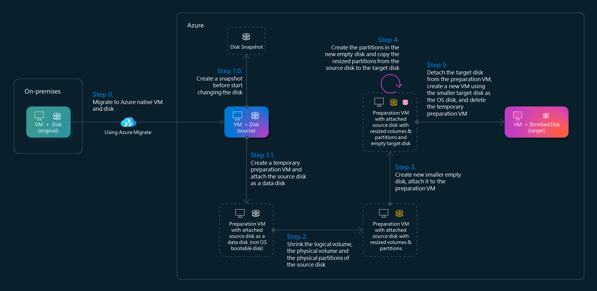
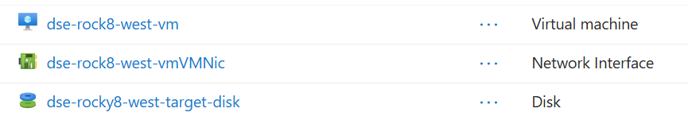

# Disk Shrinking Engine Under the Hood

The Disk Shrinking Engine (DSE) is a tool to shrink the LVM OS disk of Azure Linux Virtual Machines. It is designed to help users reduce the size of their virtual machine disks, making them more efficient and cost-effective. The engine automates the process of resizing logical volumes, physical volumes, and partitions, ensuring that the disk space is optimized without losing any data.



The process involves creating a snapshot of the original disk, preparing a new source disk, resizing logical volumes, physical volumes, and partitions, and finally creating a new VM with the target resized disk. Let's dive on each of these steps in detail.


## Step 0. Migrate the original VM to Azure

Let's assume that you already migrated your VMs to Azure (using Azure Migrate) and/or you have your Azure VMs ready to start the shrinking process.

This is an example of a migrated Azure VM named "rock8-west" ready to be processed by the DSE. We will use this source VM as an example throughout this guide. The VM is running Rocky Linux 8 and has a 32GB OS disk with LVM partitions:


If you haven't migrated your VMs to Azure yet, you can follow the steps in the [Azure Migrate documentation](https://docs.microsoft.com/en-us/azure/migrate/overview) to get started.

If you log in into the source VM, you can check the original disk layout using `lsblk` command:
This is the layout and space in the original VM:

```bash
[azureuser@localhost ~]$ lsblk
NAME              MAJ:MIN RM  SIZE RO TYPE MOUNTPOINT
sda                 8:0    0   32G  0 disk 
├─sda1              8:1    0   99M  0 part /boot/efi
├─sda2              8:2    0 1000M  0 part /boot
├─sda3              8:3    0    4M  0 part 
├─sda4              8:4    0    1M  0 part 
├─sda5              8:5    0  8.9G  0 part 
│ └─rocky-root    253:0    0  8.9G  0 lvm  /
└─sda6              8:6    0   22G  0 part 
  ├─my_vg-my_lv01 253:1    0    5G  0 lvm  /tools
  └─my_vg-my_lv02 253:2    0    6G  0 lvm  /apps
```

And the space occupied:

```bash
[azureuser@localhost ~]$ df -h
Filesystem                 Size  Used Avail Use% Mounted on
devtmpfs                   3.8G     0  3.8G   0% /dev
tmpfs                      3.8G     0  3.8G   0% /dev/shm
tmpfs                      3.8G   17M  3.8G   1% /run
tmpfs                      3.8G     0  3.8G   0% /sys/fs/cgroup
/dev/mapper/rocky-root     9.0G  1.4G  7.7G  15% /
/dev/sda2                  994M  235M  760M  24% /boot
/dev/sda1                   99M  5.8M   94M   6% /boot/efi
/dev/mapper/my_vg-my_lv02  5.9G   28K  5.6G   1% /apps
/dev/mapper/my_vg-my_lv01  4.9G   28K  4.6G   1% /tools
tmpfs                      769M     0  769M   0% /run/user/1000
```


## Step 1: Prepare source disk and create preparation VM

In this first step DSE prepares the source disk for shrinking, safeguarding the original disk. These are the actions performed:
- Create a snapshot of the original disk (step 1.0).
- Create a new source disk from the snapshot that becomes our working source disk to be resized (step 1.1).
- Create a new preparation VM with a default OS disk (step 1.1).
- Attach the source disk as a data disk to the preparation VM (step 1.1).

You can use the provided script to execute these actions (can be executed on Azure Cloud Shell) and adjust the `maxStep` variable to the maximum step you want to execute in the `.env` file. For example, if you want to execute only the first step, set `maxStep=1`:

```bash
# Usage: ./shrink_disk.sh <sourceVmName>
./shrink-disk.sh rock8-west
```

This is the expected output for Step 1:

```
----- Starting disk shrink process for VM: rock8-west... -----

----- STEP 0. Get source VM disk shrinking configuration... -----

Source volume group name: my_vg
Source logical volumes sizes: my_lv01:1G,my_lv02:1G
Target disk size: 16 GB

----- STEP 1. Preparation VM with copy of source disk... -----

----- STEP 1.1. Creating snapshot of the source disk rocky8-west in resource group vm-migration... -----

----- STEP 1.2. Creating a new copy of the source managed disk with the name dse-rocky8-west-source-disk in resource group vm-migration... -----

----- STEP 1.3. Creating a new OS disk for the preparation VM with the name dse-rock8-west-prep-vm-osdisk in resource group vm-migration... -----

----- STEP 1.4. Creating a new preparation vm dse-rock8-west-prep-vm in resource group vm-migration... -----

Selecting "uksouth" may reduce your costs. The region you've selected may cost more for the same services. You can disable this message in the future with the command "az config set core.display_region_identified=false". Learn more at https://go.microsoft.com/fwlink/?linkid=222571 

Consider upgrading security for your workloads using Azure Trusted Launch VMs. To know more about Trusted Launch, please visit https://aka.ms/TrustedLaunch.
{
  "fqdns": "",
  "id": "/subscriptions/00000000-0000-0000-0000-000000000000/resourceGroups/vm-migration/providers/Microsoft.Compute/virtualMachines/dse-rock8-west-prep-vm",
  "location": "westeurope",
  "macAddress": "60-45-BD-91-9B-77",
  "powerState": "VM running",
  "privateIpAddress": "10.0.1.4",
  "publicIpAddress": "",
  "resourceGroup": "vm-migration",
  "zones": ""
}

----- STEP 1.5. Waiting for the VM dse-rock8-west-prep-vm to be ready... -----

✅ VM is ready!

----- STEP 1. Completed. -----
```

In the end of this step, you will have the following resources created: 


A snapshot of the original source disk, a new source disk clone of the original disk, a new preparation VM with a default OS disk, and the new source disk clone attached as a data disk to the preparation VM. The original source disk and VM rest intact.

You can check the new preparation VM in the Azure portal.


If you log in into the new VM, you can check the new disk layout using `lsblk` command:

```bash
[azureuser@rocky9-prep ~]$ lsblk
NAME              MAJ:MIN RM  SIZE RO TYPE MOUNTPOINT
sda                 8:0    0   10G  0 disk 
├─sda1              8:1    0   99M  0 part /boot/efi
├─sda2              8:2    0 1000M  0 part /boot
├─sda3              8:3    0    4M  0 part 
├─sda4              8:4    0    1M  0 part 
└─sda5              8:5    0  8.9G  0 part /
sdb                 8:16   0   32G  0 disk 
├─sdb1              8:17   0   99M  0 part 
├─sdb2              8:18   0 1000M  0 part 
├─sdb3              8:19   0    4M  0 part 
├─sdb4              8:20   0    1M  0 part 
├─sdb5              8:21   0  8.9G  0 part 
│ └─rocky-root    253:2    0  8.9G  0 lvm  
└─sdb6              8:22   0   22G  0 part 
  ├─my_vg-my_lv01 253:0    0    5G  0 lvm  
  └─my_vg-my_lv02 253:1    0    6G  0 lvm  
```


## Step 2: Shrink the logical volumes, physical volume and partition

In this step we use the temporary preparation VM to resize the source disk. These are the actions to be performed:
- Check the filesystem of each logical partition.
- Resize each logical volumes to a smaller size.
- Resize the physical volume.
- Resize and partition.

Before executing the above actions, you can check the current size of the physical volume:

```bash
sudo pvs -v --segments /dev/sdb6
```

```bash
[azureuser@rocky9-prep ~]$ sudo pvs -v --segments /dev/sdb6
  PV         VG    Fmt  Attr PSize   PFree   Start SSize LV      Start Type   PE Ranges          
  /dev/sdb6  my_vg lvm2 a--  <22.00g <11.00g     0  1280 my_lv01     0 linear /dev/sdb6:0-1279   
  /dev/sdb6  my_vg lvm2 a--  <22.00g <11.00g  1280  1536 my_lv02     0 linear /dev/sdb6:1280-2815
  /dev/sdb6  my_vg lvm2 a--  <22.00g <11.00g  2816  2815             0 free
```

You can check the current partitions using `cfdisk`:

```bash
sudo cfdisk /dev/sdb
```

```bash
                                 Disk: /dev/sdb
               Size: 32 GiB, 34359738368 bytes, 67108864 sectors
          Label: gpt, identifier: 1853C561-0084-4B2A-B8F9-9C97DE4DC8E4

    Device              Start         End    Sectors    Size Type
    /dev/sdb1            2048      204799     202752     99M EFI System
    /dev/sdb2          204800     2252799    2048000   1000M Linux filesystem   
    /dev/sdb3         2252800     2260991       8192      4M PowerPC PReP boot  
    /dev/sdb4         2260992     2263039       2048      1M BIOS boot
    Free space        2263040     2265087       2048      1M
    /dev/sdb5         2265088    20969471   18704384    8.9G Linux LVM
>>  /dev/sdb6        20969472    67108830   46139359     22G Linux filesystem   


 ┌────────────────────────────────────────────────────────────────────────────┐
 │ Partition UUID: F14045BD-1F14-9242-876F-D12A1BE6010D                       │
 │ Partition type: Linux filesystem (0FC63DAF-8483-4772-8E79-3D69D8477DE4)    │
 │Filesystem UUID: a2qG8h-X1w0-1mDx-1agm-Jjn0-29VP-C6gMj3                     │
 │     Filesystem: LVM2_member                                                │
 └────────────────────────────────────────────────────────────────────────────┘
     [ Delete ]  [ Resize ]  [  Quit  ]  [  Type  ]  [  Help  ]  [  Write ]
     [  Dump  ]

                      Quit program without writing changes
```

You can do the same using `sfdisk`:

```bash
sudo sfdisk -d /dev/sdb
```

```bash
[azureuser@rocky9-prep ~]$ sudo sfdisk -d /dev/sdb
label: gpt
label-id: 1853C561-0084-4B2A-B8F9-9C97DE4DC8E4
device: /dev/sdb
unit: sectors
first-lba: 34
last-lba: 67108830

/dev/sdb1 : start=        2048, size=      202752, type=C12A7328-F81F-11D2-BA4B-00A0C93EC93B, uuid=4696C911-5B5E-4F23-9FC4-0DB41157DE29, name="EFI System Partition"
/dev/sdb2 : start=      204800, size=     2048000, type=0FC63DAF-8483-4772-8E79-3D69D8477DE4, uuid=6E9807BD-2EAA-40DA-823C-2B210F0BE219, name="primary"
/dev/sdb3 : start=     2252800, size=        8192, type=9E1A2D38-C612-4316-AA26-8B49521E5A8B, uuid=FE824B2F-CD6B-4FAE-B095-0F99882A945B, name="primary"
/dev/sdb4 : start=     2260992, size=        2048, type=21686148-6449-6E6F-744E-656564454649, uuid=62837A09-A161-4B1F-A8AF-FE250ABCC79A, name="primary"
/dev/sdb5 : start=     2265088, size=    18704384, type=E6D6D379-F507-44C2-A23C-238F2A3DF928, uuid=7E0AC02C-3E34-45C3-8757-A9A48348D3A4, name="primary"
/dev/sdb6 : start=    20969472, size=    46139359, type=0FC63DAF-8483-4772-8E79-3D69D8477DE4, uuid=F14045BD-1F14-9242-876F-D12A1BE6010D
```

Check the physical volume, volume group and logical volumes:

```bash
[azureuser@rocky9-prep ~]$ sudo pvs
  PV         VG    Fmt  Attr PSize   PFree  
  /dev/sdb5  rocky lvm2 a--   <8.92g      0 
  /dev/sdb6  my_vg lvm2 a--  <22.00g <11.00g
[azureuser@rocky9-prep ~]$ sudo lvs
  LV      VG    Attr       LSize  Pool Origin Data%  Meta%  Move Log Cpy%Sync Convert
  my_lv01 my_vg -wi-a-----  5.00g                                                    
  my_lv02 my_vg -wi-a-----  6.00g                                                    
  root    rocky -wi-a----- <8.92g                                                    
[azureuser@rocky9-prep ~]$ sudo vgs
  VG    #PV #LV #SN Attr   VSize   VFree  
  my_vg   1   2   0 wz--n- <22.00g <11.00g
  rocky   1   1   0 wz--n-  <8.92g      0 
```

You can use the provided script to execute these actions (can be executed on Azure Cloud Shell) and adjust the `maxStep` variable to the maximum step you want to execute in the `.env` file. For example, if you want to execute only until the second step, set `maxStep=2`:

```bash
# Usage: ./shrink_disk.sh <sourceVmName>
./shrink-disk.sh rock8-west
```

This is the expected output for Step 2:

```
----- STEP 2. Resizing source disk partition... -----

{
  "value": [
    {
      "code": "ProvisioningState/succeeded",
      "displayStatus": "Provisioning succeeded",
      "level": "Info",
      "message": "Enable succeeded: 
      
      [stdout]
      device: /dev/sda
      Partition number: 6

      ----- STEP 2.2. Checking filesystem... -----

      Running filesystem check on /dev/my_vg/my_lv01...
      /dev/my_vg/my_lv01: recovering journal
      Pass 1: Checking inodes, blocks, and sizes
      Pass 2: Checking directory structure
      Pass 3: Checking directory connectivity
      Pass 3A: Optimizing directories
      Pass 4: Checking reference counts
      Pass 5: Checking group summary information

      /dev/my_vg/my_lv01: ***** FILE SYSTEM WAS MODIFIED *****
      /dev/my_vg/my_lv01: 12/327680 files (0.0% non-contiguous), 42079/1310720 blocks
      Running filesystem check on /dev/my_vg/my_lv02...
      /dev/my_vg/my_lv02: recovering journal
      Pass 1: Checking inodes, blocks, and sizes
      Pass 2: Checking directory structure
      Pass 3: Checking directory connectivity
      Pass 3A: Optimizing directories
      Pass 4: Checking reference counts
      Pass 5: Checking group summary information

      /dev/my_vg/my_lv02: ***** FILE SYSTEM WAS MODIFIED *****
      /dev/my_vg/my_lv02: 12/393216 files (0.0% non-contiguous), 47215/1572864 blocks

      ----- STEP 2.3. Resizing logical volumes... -----

      Resizing /dev/my_vg/my_lv01 to 1G...
      fsck from util-linux 2.32.1
      /dev/mapper/my_vg-my_lv01: clean, 12/327680 files, 42079/1310720 blocks
      Resizing the filesystem on /dev/mapper/my_vg-my_lv01 to 262144 (4k) blocks.
      The filesystem on /dev/mapper/my_vg-my_lv01 is now 262144 (4k) blocks long.

        Size of logical volume my_vg/my_lv01 changed from 5.00 GiB (1280 extents) to 1.00 GiB (256 extents).
        Logical volume my_vg/my_lv01 successfully resized.
      Resizing /dev/my_vg/my_lv02 to 1G...
      fsck from util-linux 2.32.1
      /dev/mapper/my_vg-my_lv02: clean, 12/393216 files, 47215/1572864 blocks
      Resizing the filesystem on /dev/mapper/my_vg-my_lv02 to 262144 (4k) blocks.
      The filesystem on /dev/mapper/my_vg-my_lv02 is now 262144 (4k) blocks long.

        Size of logical volume my_vg/my_lv02 changed from 6.00 GiB (1536 extents) to 1.00 GiB (256 extents).
        Logical volume my_vg/my_lv02 successfully resized.

      ----- STEP 2.4. Resizing physical volume... -----

        /dev/sda6: Moved: 11.33%
        /dev/sda6: Moved: 78.52%
        /dev/sda6: Moved: 100.00%
        Physical volume \"/dev/sda6\" changed
        1 physical volume(s) resized or updated / 0 physical volume(s) not resized
      Total allocated extents 512
      Remaining segments to move 256 / 256 
      Moving 256 blocks from 1280 to 256
      256 of 256 (100.00%) done
      Total allocated extents 512
      Defragmentation complete.
      Metadata size: 1048576 b
      PE size: 4.0 MiB
      Total size 1048576 b + 512 x 4194304 b = 2148532224 b (2.0 GiB)
      Minimum partition size is 2148532224 b = 4196352 x 512 b sectors

      ----- STEP 2.5. Resizing partition... -----

      Resizing partition partition with a total of 4198434 sectors
      Disk /dev/sda: 32 GiB, 34359738368 bytes, 67108864 sectors
      Units: sectors of 1 * 512 = 512 bytes
      Sector size (logical/physical): 512 bytes / 4096 bytes
      I/O size (minimum/optimal): 4096 bytes / 4096 bytes
      Disklabel type: gpt
      Disk identifier: 1853C561-0084-4B2A-B8F9-9C97DE4DC8E4

      Old situation:

      Device        Start      End  Sectors  Size Type
      /dev/sda1      2048   204799   202752   99M EFI System
      /dev/sda2    204800  2252799  2048000 1000M Linux filesystem
      /dev/sda3   2252800  2260991     8192    4M PowerPC PReP boot
      /dev/sda4   2260992  2263039     2048    1M BIOS boot
      /dev/sda5   2265088 20969471 18704384  8.9G Linux LVM
      /dev/sda6  20969472 67108830 46139359   22G Linux filesystem

      /dev/sda6: 
      New situation:
      Disklabel type: gpt
      Disk identifier: 1853C561-0084-4B2A-B8F9-9C97DE4DC8E4

      Device        Start      End  Sectors  Size Type
      /dev/sda1      2048   204799   202752   99M EFI System
      /dev/sda2    204800  2252799  2048000 1000M Linux filesystem
      /dev/sda3   2252800  2260991     8192    4M PowerPC PReP boot
      /dev/sda4   2260992  2263039     2048    1M BIOS boot
      /dev/sda5   2265088 20969471 18704384  8.9G Linux LVM
      /dev/sda6  20969472 25167905  4198434    2G Linux filesystem

      The partition table has been altered.
      Calling ioctl() to re-read partition table.
      The kernel still uses the old table. The new table will be used at the next reboot or after you run partprobe(8) or kpartx(8).
      Syncing disks.

      ----- STEP 2. Completed. -----


      [stderr]
      e2fsck 1.45.6 (20-Mar-2020)
      e2fsck 1.45.6 (20-Mar-2020)
      resize2fs 1.45.6 (20-Mar-2020)
      resize2fs 1.45.6 (20-Mar-2020)
       % Total    % Received % Xferd  Average Speed   Time    Time     Time  Current
                                      Dload  Upload   Total   Spent    Left  Speed
        0     0    0     0    0     0      0      0 --:--:-- --:--:-- --:--:--     0
      100  4693  100  4693    0     0  21429      0 --:--:-- --:--:-- --:--:-- 21429
        WARNING: /dev/sda6: Pretending size is 4196352 not 46139359 sectors.
        Resizing volume \"/dev/sda6\" to 4196352 sectors.
        Resizing physical volume /dev/sda6 from 5631 to 512 extents.
        Updating physical volume \"/dev/sda6\"
        Archiving volume group \"my_vg\" metadata (seqno 8).
        Creating volume group backup \"/etc/lvm/backup/my_vg\" (seqno 9).
      Re-reading the partition table failed.: Device or resource busy
      ",
      "time": null
    }
  ]
}

----- STEP 2. Completed. -----
```

You can login to the preparation VM and check the new size of the physical volume:

```bash
lsblk
```

```bash
[azureuser@rocky9-prep ~]$ lsblk
NAME              MAJ:MIN RM  SIZE RO TYPE MOUNTPOINT
sda                 8:0    0   32G  0 disk 
├─sda1              8:1    0   99M  0 part 
├─sda2              8:2    0 1000M  0 part 
├─sda3              8:3    0    4M  0 part 
├─sda4              8:4    0    1M  0 part 
├─sda5              8:5    0  8.9G  0 part 
│ └─rocky-root    253:1    0  8.9G  0 lvm  
└─sda6              8:6    0   22G  0 part 
  ├─my_vg-my_lv01 253:0    0    1G  0 lvm  
  └─my_vg-my_lv02 253:2    0    1G  0 lvm  
sdb                 8:16   0   10G  0 disk 
├─sdb1              8:17   0   99M  0 part /boot/efi
├─sdb2              8:18   0 1000M  0 part /boot
├─sdb3              8:19   0    4M  0 part 
├─sdb4              8:20   0    1M  0 part 
└─sdb5              8:21   0  8.9G  0 part /
```

```bash
sudo pvs -v --segments /dev/sda6
```

```bash
[azureuser@rocky9-prep ~]$ sudo pvs -v --segments /dev/sda6
  PV         VG    Fmt  Attr PSize PFree Start SSize LV      Start Type   PE Ranges        
  /dev/sda6  my_vg lvm2 a--  2.00g    0      0   256 my_lv01     0 linear /dev/sda6:0-255  
  /dev/sda6  my_vg lvm2 a--  2.00g    0    256   256 my_lv02     0 linear /dev/sda6:256-511
```

You can check the new partitions using `cfdisk`:

```bash
sudo cfdisk /dev/sda
```

```bash
                                 Disk: /dev/sda
               Size: 32 GiB, 34359738368 bytes, 67108864 sectors
          Label: gpt, identifier: 1853C561-0084-4B2A-B8F9-9C97DE4DC8E4

    Device              Start         End    Sectors    Size Type
    /dev/sda1            2048      204799     202752     99M EFI System
    /dev/sda2          204800     2252799    2048000   1000M Linux filesystem   
    /dev/sda3         2252800     2260991       8192      4M PowerPC PReP boot  
    /dev/sda4         2260992     2263039       2048      1M BIOS boot
    Free space        2263040     2265087       2048      1M
    /dev/sda5         2265088    20969471   18704384    8.9G Linux LVM
>>  /dev/sda6        20969472    25167905    4198434      2G Linux filesystem   
    Free space       25169920    67108830   41938911     20G
 ┌────────────────────────────────────────────────────────────────────────────┐
 │ Partition UUID: F14045BD-1F14-9242-876F-D12A1BE6010D                       │
 │ Partition type: Linux filesystem (0FC63DAF-8483-4772-8E79-3D69D8477DE4)    │
 │Filesystem UUID: a2qG8h-X1w0-1mDx-1agm-Jjn0-29VP-C6gMj3                     │
 │     Filesystem: LVM2_member                                                │
 └────────────────────────────────────────────────────────────────────────────┘

     [ Delete ]  [ Resize ]  [  Quit  ]  [  Type  ]  [  Help  ]  [  Write ]
     [  Dump  ]

                      Quit program without writing changes
```

Need to reboot the VM after this partition resize.


## Step 3. Create new empty disk and attach to preparation VM

In this step we prepare the new target disk. These are the actions to be performed:
- Reboot the preparation VM.
- Create a new empty target disk with a smaller size (64GB).
- Attach target disk to the preparation VM.

You can use the provided script to execute these actions (can be executed on Azure Cloud Shell) and adjust the `maxStep` variable to the maximum step you want to execute in the `.env` file. For example, if you want to execute only until the third step, set `maxStep=3`:

```bash
# Usage: ./shrink_disk.sh <sourceVmName>
./shrink-disk.sh rock8-west
```

This is the expected output for Step 3:

```
----- STEP 3. Prepare target disk... -----

----- STEP 3.1. Rebooting preparation VM dse-rock8-west-prep-vm... -----

----- STEP 3.2. Waiting for the VM dse-rock8-west-prep-vm to be ready... -----

✅ VM is ready!

----- STEP 3.3. Creating new target empty disk dse-rocky8-west-target-disk and attaching it to preparation VM... -----

----- STEP 3. Completed. -----
```

Now you will have both the source resized partitions disk `/dev/sda` (32G) and the new target empty disk `/dev/sdc` (16G). If you log in into the preparation VM, you can check the new disk using `lsblk` command:

```bash
NAME              MAJ:MIN RM  SIZE RO TYPE MOUNTPOINT
sda                 8:0    0   32G  0 disk 
├─sda1              8:1    0   99M  0 part 
├─sda2              8:2    0 1000M  0 part 
├─sda3              8:3    0    4M  0 part 
├─sda4              8:4    0    1M  0 part 
├─sda5              8:5    0  8.9G  0 part 
│ └─rocky-root    253:2    0  8.9G  0 lvm  
└─sda6              8:6    0    2G  0 part 
  ├─my_vg-my_lv01 253:0    0    1G  0 lvm  
  └─my_vg-my_lv02 253:1    0    1G  0 lvm  
sdb                 8:32   0   10G  0 disk 
├─sdb1              8:33   0   99M  0 part /boot/efi
├─sdb2              8:34   0 1000M  0 part /boot
├─sdb3              8:35   0    4M  0 part 
├─sdb4              8:36   0    1M  0 part 
└─sdb5              8:37   0  8.9G  0 part /
sdc                 8:16   0   16G  0 disk 
```

In the Azure Portal you can also checks the attached data disks (source and target) of the preparation VM:


## Step 4. Create and copy partitions to the new target disk

In this step we continue to use the temporary preparation VM to finish the preparation of the new target disk. These are the actions to be performed:
- Dump the partitions layout from the resized source disk. 
- Create new partitions in the target empty disk by mirroring the partitions layout dumped from the source disk.
- Copy the partitions from the source disk to the target disk.

You can use the provided script to execute these actions (can be executed on Azure Cloud Shell) and adjust the `maxStep` variable to the maximum step you want to execute in the `.env` file. For example, if you want to execute only until the forth step, set `maxStep=4`:

```bash
# Usage: ./shrink_disk.sh <sourceVmName>
./shrink-disk.sh rock8-west
```

This is the expected output for Step 4:

```
----- STEP 4. Copy partitions: source to target... -----

{
  "value": [
    {
      "code": "ProvisioningState/succeeded",
      "displayStatus": "Provisioning succeeded",
      "level": "Info",
      "message": "Enable succeeded: 
        [stdout]

        ----- STEP 4. Copy partitions: source to target... -----

        Source device: /dev/sdb
        Target device: /dev/sdc

        ----- STEP 4.1. Getting original partitions layout... -----


        ----- STEP 4.2. Creating new partions... -----

        Checking that no-one is using this disk right now ... OK

        Disk /dev/sdc: 16 GiB, 17179869184 bytes, 33554432 sectors
        Units: sectors of 1 * 512 = 512 bytes
        Sector size (logical/physical): 512 bytes / 4096 bytes
        I/O size (minimum/optimal): 4096 bytes / 4096 bytes

        >>> Script header accepted.
        >>> Script header accepted.
        >>> Script header accepted.
        >>> Script header accepted.
        >>> Created a new GPT disklabel (GUID: 1853C561-0084-4B2A-B8F9-9C97DE4DC8E4).
        /dev/sdc1: Created a new partition 1 of type 'EFI System' and of size 99 MiB.
        /dev/sdc2: Created a new partition 2 of type 'Linux filesystem' and of size 1000 MiB.
        /dev/sdc3: Created a new partition 3 of type 'PowerPC PReP boot' and of size 4 MiB.
        /dev/sdc4: Created a new partition 4 of type 'BIOS boot' and of size 1 MiB.
        /dev/sdc5: Created a new partition 5 of type 'Linux LVM' and of size 8.9 GiB.
        /dev/sdc6: Created a new partition 6 of type 'Linux filesystem' and of size 2 GiB.
        /dev/sdc7: Done.

        New situation:
        Disklabel type: gpt
        Disk identifier: 1853C561-0084-4B2A-B8F9-9C97DE4DC8E4

        Device        Start      End  Sectors  Size Type
        /dev/sdc1      2048   204799   202752   99M EFI System
        /dev/sdc2    204800  2252799  2048000 1000M Linux filesystem
        /dev/sdc3   2252800  2260991     8192    4M PowerPC PReP boot
        /dev/sdc4   2260992  2263039     2048    1M BIOS boot
        /dev/sdc5   2265088 20969471 18704384  8.9G Linux LVM
        /dev/sdc6  20969472 25167905  4198434    2G Linux filesystem

        The partition table has been altered.
        Calling ioctl() to re-read partition table.
        Syncing disks.
        label: gpt
        label-id: 1853C561-0084-4B2A-B8F9-9C97DE4DC8E4
        device: /dev/sdc
        unit: sectors
        first-lba: 34
        last-lba: 33554398

        /dev/sdc1 : start=        2048, size=      202752, type=C12A7328-F81F-11D2-BA4B-00A0C93EC93B, uuid=4696C911-5B5E-4F23-9FC4-0DB41157DE29, name=\"EFI System Partition\"
        /dev/sdc2 : start=      204800, size=     2048000, type=0FC63DAF-8483-4772-8E79-3D69D8477DE4, uuid=6E9807BD-2EAA-40DA-823C-2B210F0BE219, name=\"primary\"
        /dev/sdc3 : start=     2252800, size=        8192, type=9E1A2D38-C612-4316-AA26-8B49521E5A8B, uuid=FE824B2F-CD6B-4FAE-B095-0F99882A945B, name=\"primary\"
        /dev/sdc4 : start=     2260992, size=        2048, type=21686148-6449-6E6F-744E-656564454649, uuid=62837A09-A161-4B1F-A8AF-FE250ABCC79A, name=\"primary\"
        /dev/sdc5 : start=     2265088, size=    18704384, type=E6D6D379-F507-44C2-A23C-238F2A3DF928, uuid=7E0AC02C-3E34-45C3-8757-A9A48348D3A4, name=\"primary\"
        /dev/sdc6 : start=    20969472, size=     4198434, type=0FC63DAF-8483-4772-8E79-3D69D8477DE4, uuid=F14045BD-1F14-9242-876F-D12A1BE6010D

        ----- STEP 4.3. Copying partitions... -----

        Source device /dev/sdb has 6 partitions.
        Copying partition 1...
        Copying partition 2...
        Copying partition 3...
        Copying partition 4...
        Copying partition 5...
        Copying partition 6...

        ----- STEP 4. Completed. -----

        [stderr]
        5595201536 bytes (5.6 GB, 5.2 GiB) copied, 56 s, 99.9 MB/s
        5691670528 bytes (5.7 GB, 5.3 GiB) copied, 57 s, 99.8 MB/s
        5796528128 bytes (5.8 GB, 5.4 GiB) copied, 58 s, 99.9 MB/s
        5901385728 bytes (5.9 GB, 5.5 GiB) copied, 59 s, 100 MB/s 
        6002049024 bytes (6.0 GB, 5.6 GiB) copied, 60 s, 100 MB/s
        6106906624 bytes (6.1 GB, 5.7 GiB) copied, 61 s, 100 MB/s
        6203375616 bytes (6.2 GB, 5.8 GiB) copied, 62 s, 100 MB/s
        6308233216 bytes (6.3 GB, 5.9 GiB) copied, 63 s, 100 MB/s
        6408896512 bytes (6.4 GB, 6.0 GiB) copied, 64 s, 100 MB/s
        6509559808 bytes (6.5 GB, 6.1 GiB) copied, 65 s, 100 MB/s
        6610223104 bytes (6.6 GB, 6.2 GiB) copied, 66 s, 100 MB/s
        6715080704 bytes (6.7 GB, 6.3 GiB) copied, 67 s, 100 MB/s
        6815744000 bytes (6.8 GB, 6.3 GiB) copied, 68 s, 100 MB/s
        6916407296 bytes (6.9 GB, 6.4 GiB) copied, 69 s, 100 MB/s
        7017070592 bytes (7.0 GB, 6.5 GiB) copied, 70 s, 100 MB/s
        7113539584 bytes (7.1 GB, 6.6 GiB) copied, 71 s, 100 MB/s
        7222591488 bytes (7.2 GB, 6.7 GiB) copied, 72 s, 100 MB/s
        7319060480 bytes (7.3 GB, 6.8 GiB) copied, 73 s, 100 MB/s
        7419723776 bytes (7.4 GB, 6.9 GiB) copied, 74 s, 100 MB/s
        7507804160 bytes (7.5 GB, 7.0 GiB) copied, 75 s, 100 MB/s
        7595884544 bytes (7.6 GB, 7.1 GiB) copied, 76 s, 99.8 MB/s
        7696547840 bytes (7.7 GB, 7.2 GiB) copied, 77 s, 99.9 MB/s
        7797211136 bytes (7.8 GB, 7.3 GiB) copied, 78 s, 99.9 MB/s
        7885291520 bytes (7.9 GB, 7.3 GiB) copied, 79 s, 99.8 MB/s
        7994343424 bytes (8.0 GB, 7.4 GiB) copied, 80 s, 99.9 MB/s
        8099201024 bytes (8.1 GB, 7.5 GiB) copied, 81 s, 100 MB/s 
        8199864320 bytes (8.2 GB, 7.6 GiB) copied, 82 s, 99.9 MB/s
        8304721920 bytes (8.3 GB, 7.7 GiB) copied, 83 s, 100 MB/s 
        8392802304 bytes (8.4 GB, 7.8 GiB) copied, 84 s, 99.9 MB/s
        8506048512 bytes (8.5 GB, 7.9 GiB) copied, 85 s, 100 MB/s 
        8602517504 bytes (8.6 GB, 8.0 GiB) copied, 86 s, 100 MB/s
        8707375104 bytes (8.7 GB, 8.1 GiB) copied, 87 s, 100 MB/s
        8812232704 bytes (8.8 GB, 8.2 GiB) copied, 88 s, 100 MB/s
        8912896000 bytes (8.9 GB, 8.3 GiB) copied, 89 s, 100 MB/s
        9017753600 bytes (9.0 GB, 8.4 GiB) copied, 90 s, 100 MB/s
        9118416896 bytes (9.1 GB, 8.5 GiB) copied, 91 s, 100 MB/s
        9189720064 bytes (9.2 GB, 8.6 GiB) copied, 94 s, 97.5 MB/s
        9193914368 bytes (9.2 GB, 8.6 GiB) copied, 94 s, 97.6 MB/s
        9198108672 bytes (9.2 GB, 8.6 GiB) copied, 94 s, 97.6 MB/s
        9281994752 bytes (9.3 GB, 8.6 GiB) copied, 95 s, 97.6 MB/s
        9378463744 bytes (9.4 GB, 8.7 GiB) copied, 96 s, 97.7 MB/s
        9483321344 bytes (9.5 GB, 8.8 GiB) copied, 97 s, 97.7 MB/s
        2283+1 records in
        2283+1 records out
        9576644608 bytes (9.6 GB, 8.9 GiB) copied, 99.734 s, 96.0 MB/s

        104857600 bytes (105 MB, 100 MiB) copied, 1 s, 104 MB/s
        205520896 bytes (206 MB, 196 MiB) copied, 2 s, 102 MB/s
        306184192 bytes (306 MB, 292 MiB) copied, 3 s, 102 MB/s
        411041792 bytes (411 MB, 392 MiB) copied, 4 s, 103 MB/s
        511705088 bytes (512 MB, 488 MiB) copied, 5 s, 102 MB/s
        612368384 bytes (612 MB, 584 MiB) copied, 6 s, 102 MB/s
        713031680 bytes (713 MB, 680 MiB) copied, 7 s, 102 MB/s
        817889280 bytes (818 MB, 780 MiB) copied, 8 s, 102 MB/s
        910163968 bytes (910 MB, 868 MiB) copied, 9 s, 101 MB/s
        1010827264 bytes (1.0 GB, 964 MiB) copied, 10 s, 101 MB/s
        1115684864 bytes (1.1 GB, 1.0 GiB) copied, 11 s, 101 MB/s
        1220542464 bytes (1.2 GB, 1.1 GiB) copied, 12 s, 101 MB/s
        1321205760 bytes (1.3 GB, 1.2 GiB) copied, 13 s, 101 MB/s
        1421869056 bytes (1.4 GB, 1.3 GiB) copied, 14 s, 101 MB/s
        1526726656 bytes (1.5 GB, 1.4 GiB) copied, 15 s, 101 MB/s
        1627389952 bytes (1.6 GB, 1.5 GiB) copied, 16 s, 101 MB/s
        1723858944 bytes (1.7 GB, 1.6 GiB) copied, 17 s, 101 MB/s
        1786773504 bytes (1.8 GB, 1.7 GiB) copied, 18 s, 99.0 MB/s
        1841299456 bytes (1.8 GB, 1.7 GiB) copied, 19 s, 96.7 MB/s
        1895825408 bytes (1.9 GB, 1.8 GiB) copied, 20 s, 94.4 MB/s
        1946157056 bytes (1.9 GB, 1.8 GiB) copied, 21 s, 92.4 MB/s
        1996488704 bytes (2.0 GB, 1.9 GiB) copied, 22 s, 90.5 MB/s
        2046820352 bytes (2.0 GB, 1.9 GiB) copied, 23 s, 88.8 MB/s
        2097152000 bytes (2.1 GB, 2.0 GiB) copied, 24 s, 87.3 MB/s
        2149598208 bytes (2.1 GB, 2.0 GiB) copied, 25 s, 85.9 MB/s
        512+1 records in
        512+1 records out
        2149598208 bytes (2.1 GB, 2.0 GiB) copied, 40.9122 s, 52.5 MB/s
        ",
      "time": null
    }
  ]
}

----- STEP 4. Completed. -----
```

## Step 5. Create target VM with the new target disk

These are the operations to be performed:
- Detach the disk from the preparation VM
- Create a new VM with the new disk or attach the disk to an existing VM

You can use the provided script to execute these actions (can be executed on Azure Cloud Shell) and adjust the `maxStep` variable to the maximum step you want to execute in the `.env` file. For example, if you want to execute only until the fifth step, set `maxStep=5`:

```bash
# Usage: ./shrink_disk.sh <sourceVmName>
./shrink-disk.sh rock8-west
```

This is the expected output for Step 5:

```
----- STEP 5. Create new virtual machine with shrinked disk... -----

----- STEP 5.1. Detaching target disk dse-rocky8-west-target-disk from preparation VM... -----

Managed disk 'dse-rocky8-west-target-disk' detached from VM 'dse-rock8-west-prep-vm'.

----- STEP 5.2. Creating target virtual machine dse-rock8-west-vm... -----

Selecting "uksouth" may reduce your costs. The region you've selected may cost more for the same services. You can disable this message in the future with the command "az config set core.display_region_identified=false". Learn more at https://go.microsoft.com/fwlink/?linkid=222571 

Consider upgrading security for your workloads using Azure Trusted Launch VMs. To know more about Trusted Launch, please visit https://aka.ms/TrustedLaunch.
{
  "fqdns": "",
  "id": "/subscriptions/00000000-0000-0000-0000-000000000000/resourceGroups/vm-migration/providers/Microsoft.Compute/virtualMachines/dse-rock8-west-vm",
  "location": "westeurope",
  "macAddress": "7C-1E-52-27-6E-2C",
  "powerState": "VM running",
  "privateIpAddress": "10.0.0.4",
  "publicIpAddress": "",
  "resourceGroup": "vm-migration",
  "zones": ""
}

----- STEP 5. Completed. -----
```

You now have a new target VM with the new smaller target disk.




You can login to the newly created target VM and check the new disk layout and size (16GB in our example):

```bash
lsblk
df -h
```

```bash
[azureuser@localhost ~]$ lsblk
NAME              MAJ:MIN RM  SIZE RO TYPE MOUNTPOINT
sda                 8:0    0   16G  0 disk 
├─sda1              8:1    0   99M  0 part /boot/efi
├─sda2              8:2    0 1000M  0 part /boot
├─sda3              8:3    0    4M  0 part 
├─sda4              8:4    0    1M  0 part 
├─sda5              8:5    0  8.9G  0 part 
│ └─rocky-root    253:0    0  8.9G  0 lvm  /
└─sda6              8:6    0    2G  0 part 
  ├─my_vg-my_lv01 253:1    0    1G  0 lvm  /tools
  └─my_vg-my_lv02 253:2    0    1G  0 lvm  /apps
```

```bash
[azureuser@localhost ~]$ df -h
Filesystem                 Size  Used Avail Use% Mounted on
devtmpfs                   3.8G     0  3.8G   0% /dev
tmpfs                      3.8G     0  3.8G   0% /dev/shm
tmpfs                      3.8G   25M  3.8G   1% /run
tmpfs                      3.8G     0  3.8G   0% /sys/fs/cgroup
/dev/mapper/rocky-root     9.0G  1.4G  7.7G  15% /
/dev/sda2                  994M  235M  760M  24% /boot
/dev/sda1                   99M  5.8M   94M   6% /boot/efi
/dev/mapper/my_vg-my_lv02  929M   28K  862M   1% /apps
/dev/mapper/my_vg-my_lv01  932M   28K  865M   1% /tools
tmpfs                      769M     0  769M   0% /run/user/1000
```


## Step 6. Clean up the preparation VM

These are the operations to be performed:
- Delete the preparation VM and associated nic, OS disk and initial clone of the source disk
- For now, this step is not cleaning up the snapshot of the original source disk nor the original source VM

You can use the provided script to execute these actions (can be executed on Azure Cloud Shell) and adjust the `maxStep` variable to the maximum step you want to execute in the `.env` file. For example, if you want to execute until this last sixth step, set `maxStep=6`:

```bash
# Usage: ./shrink_disk.sh <sourceVmName>
./shrink-disk.sh rock8-west
```

This is the expected output for Step 6:

```
----- STEP 6. Cleaning up the preparation VM dse-rock8-west-prep-vm... -----

Preparation VM and associated resources cleaned up.

----- STEP 6. Completed. -----
```

In the Azure Portal you can check that the preparation VM is deleted.


## References

- [Disk partition tools](https://linuxnatives.net/2019/partition-like-a-pro-with-fdisk-sfdisk-and-cfdisk)
- [pvshrink script](https://raw.githubusercontent.com/mythic-beasts/pvshrink/refs/heads/master/pvshrink)
